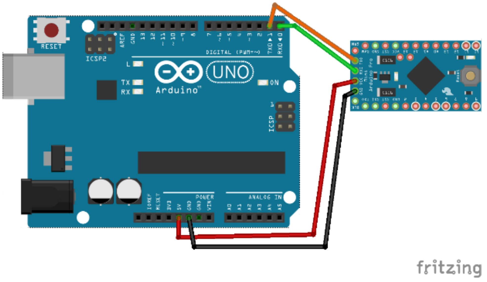

# Mini Drone using Arduino mini micro controller unit

A low cost drone using Arduino mini, DC motors, and a mobile battery. It can be controlled by an android application. The connection between the drone &amp; the application is done by the Bluetooth module present in the Arduino mini. 

### What a is tricoptor?

* It’s an aircraft similar to a helicopter except it has three rotor .
 * The beauty of the design is that it derives lift and propulsion from  three sets of horizontally revolving rotors.

  
   <i>Figure : Showing the Flight Dynamics of the drone</i>

## Major components

  
   <i>Figure : Showing the Flight Dynamics of the drone</i>

## Connecting Mini Arduino for Programming

  
   <i>Figure : Showing the Flight Dynamics of the drone</i>

## Video demo

  <a href="https://www.youtube.com/watch?v=B13oQvVGCp4&list=PLWdzmf_yjOGsEBxtbmLwkprN09FwD6ldS" target="popup" > >Click Here< </a>

